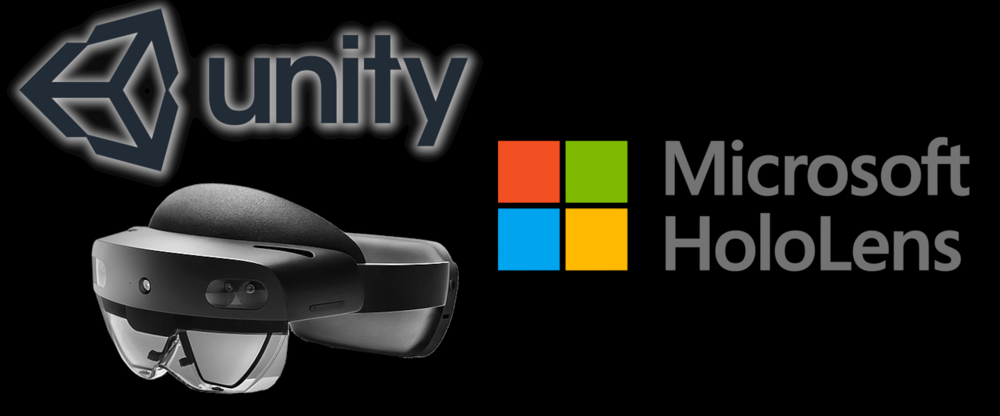
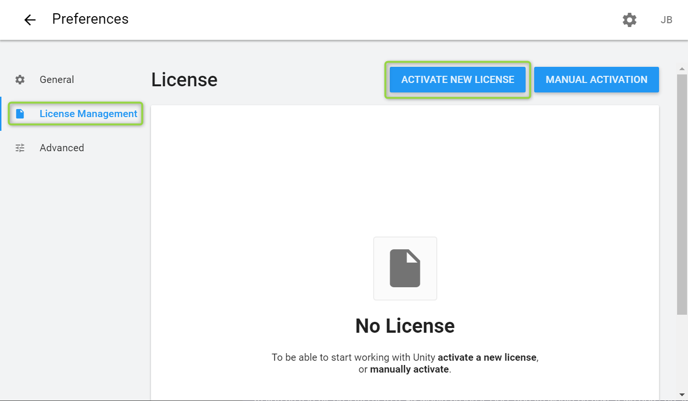
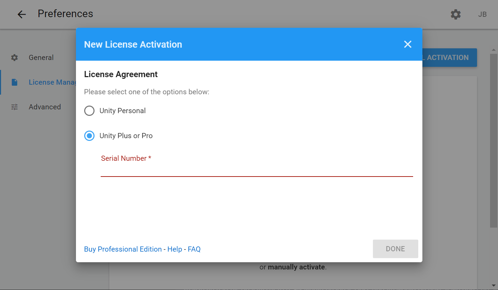
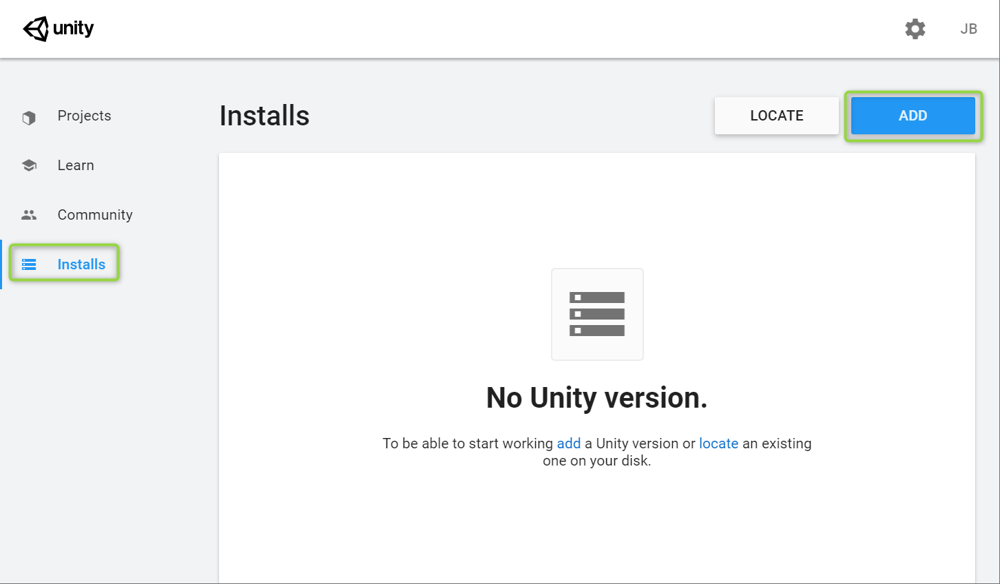
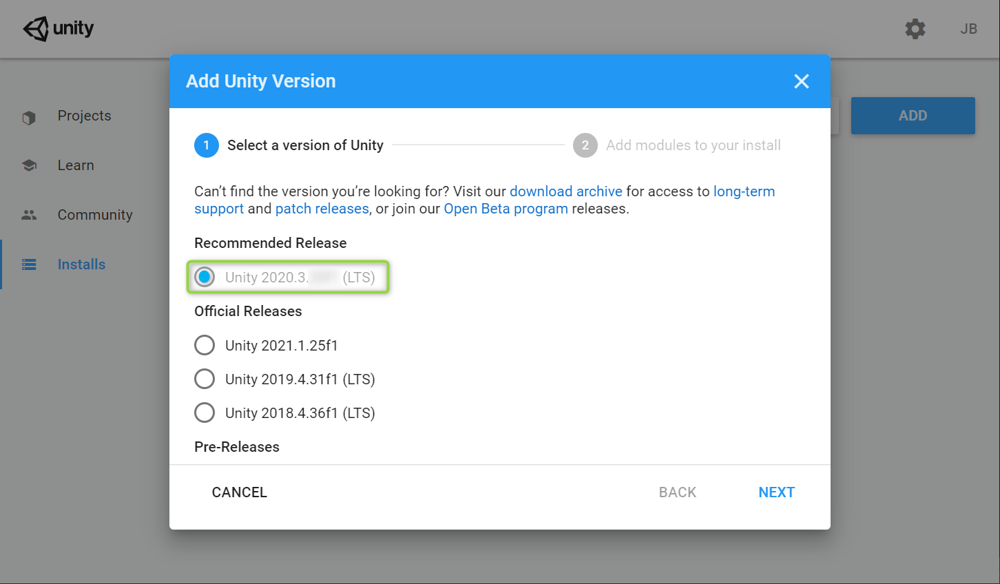
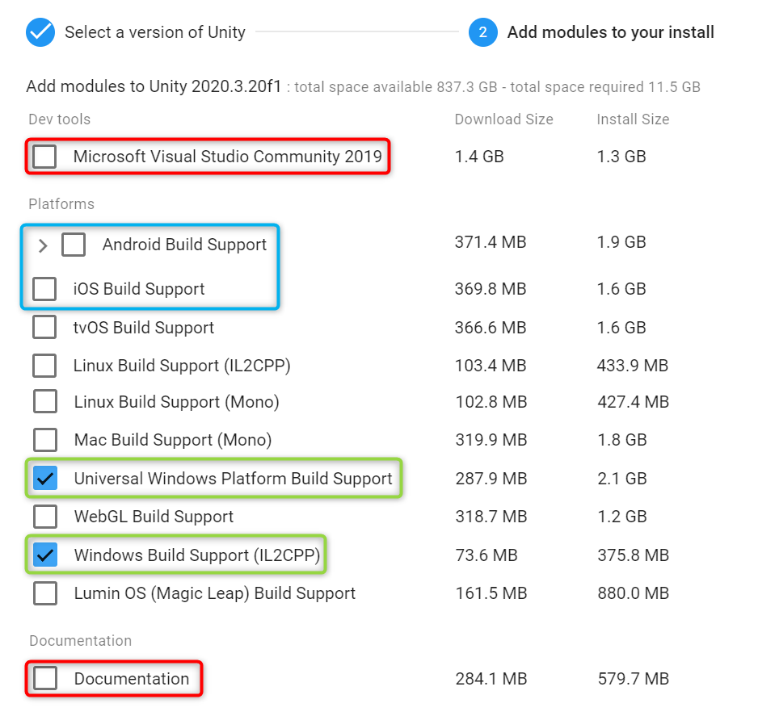

This page will help you get Unity installed properly for building applications on HoloLens. Note that the installation can take anywhere from 15 minutes to an hour depending on your internet connection and computer.  

## Versions Supported
It's *highly* recommended to use a LTS version of Unity 2020.3 or later. 

*Unity 2019 builds are **NOT** recommended.*

## Install Unity Hub

If you followed the steps in [Visual Studio for MR](../VSForMR) *you should already have Unity Hub installed*. 

If not, Unity Hub can be installed from [this page](https://unity3d.com/get-unity/download). But be sure to click the button that says **Download Unity Hub** and not the button that says **choose your Unity**.

## Launch and Sign-In
Unity hub can be found on your start menu. It's normally in a sub-folder called "Unity".

As soon as Unity Hub is launched, you'll want to sign in with a Unity account. This can be done with the user button at the top-right side of the screen.

If you don't have a Unity account yet, create one at [unity.com](https://unity.com/), then sign into Unity Hub.

## Licensing
Next we need to activate a license. You can do this by going to the **License Management** tab and clicking **ACTIVATE NEW LICENSE**. 

Microsoft employees **MUST** choose **Pro** and enter their serial number.

If you are a Microsoft employee and do not have a Unity pro license, you can request a temporary license for this event [here](https://aka.ms/Unity-MR-License-Request).

## Install Unity Editor
Finally, we can install the Unity editor. Go to the **Installs** tab and click **ADD**.
 

In the window that pops up, pick the latest version that begins with **2020.3** and ends with **LTS**.

**LTS** means "Long-Term Support", and these represent the most stable versions of Unity.

### Features
When asked to select Unity features, use the following values:

- **Microsoft Visual Studio Community** isn't needed because we already installed it in [Visual Studio for MR](../VSForMR).
- **Android and iOS** are optional, but you can add them if you want to build for one during this event.
- **Universal Windows Platform Build Support** is *required* for HoloLens.
- **Windows Build Support (IL2CPP)** is *required* for HoloLens.
- **Documentation** is available online and only needs to be installed for offline access.

Click **Next** to install, and when complete Unity is ready for MR development.