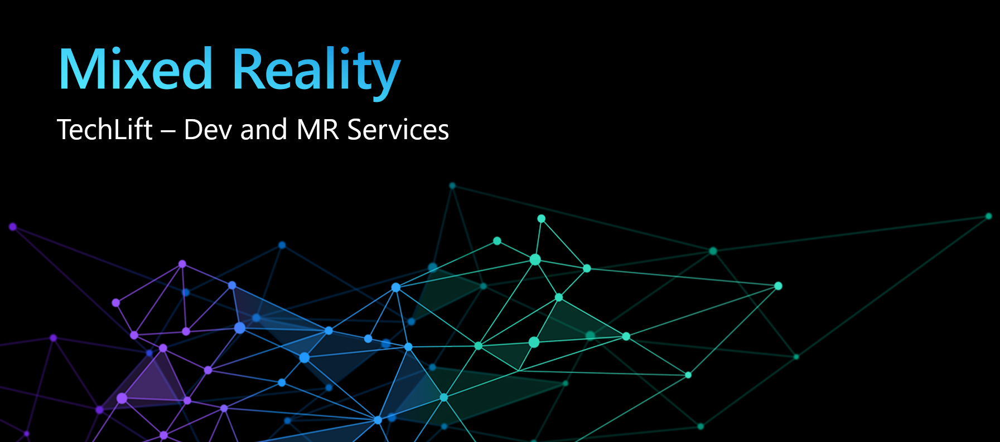
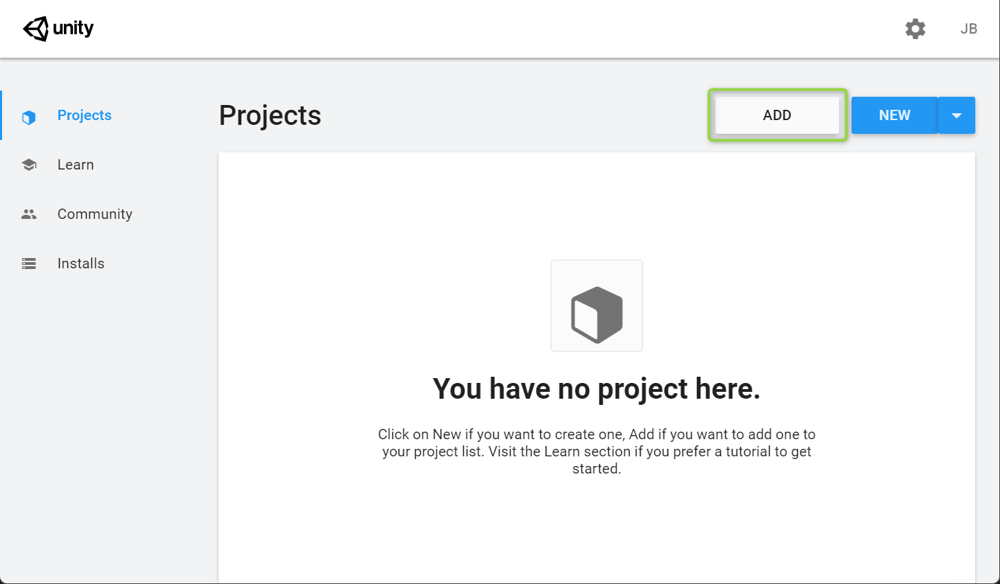
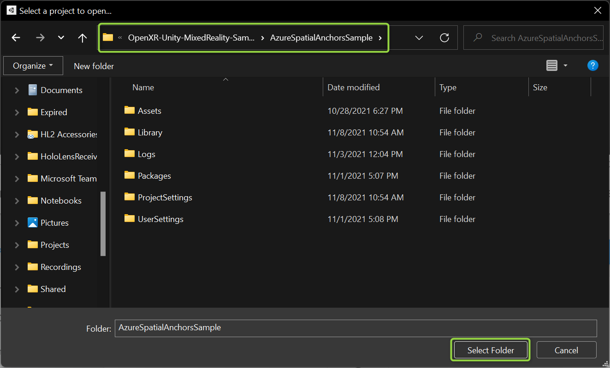
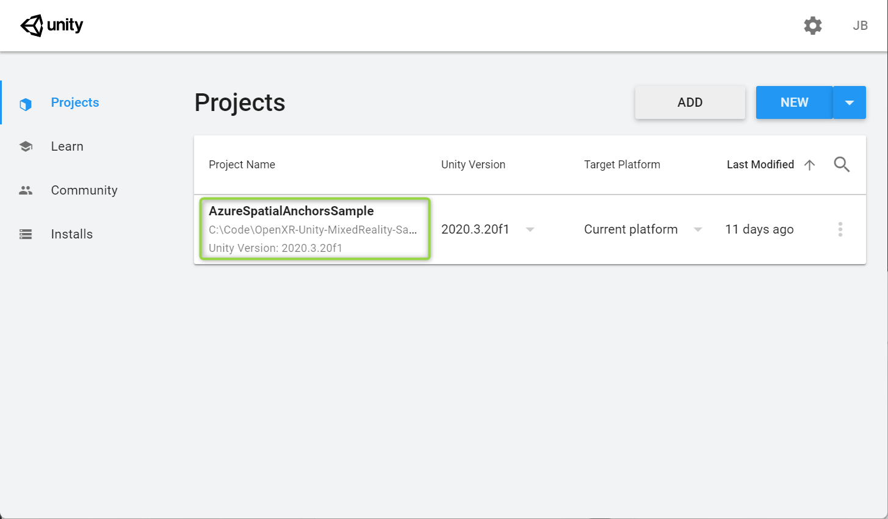

# Day 2 - Azure Spatial Anchors

Welcome to **Day 2** of the **Dev and MR Services** Track! Today we'll learn how **Azure Spatial Anchors** works and how  partners can benefit from it. We'll builds some interactive labs, and start working on our Team Hack project.

## Presentation

A copy of the presentation can be downloaded here: [Azure Spatial Anchors Technical Overview](https://microsoft.sharepoint.com/:p:/t/MRTechLift/ESwQKH1PL-pHkibU_0A_W98BxR8X_zb4CHTIi2Fi3D5yPg?e=XV1HPb).

**IMPORTANT:** For Microsoft employees attending TechLift 2021, the presentation above is **Internal-Only**.

## Hands-On Labs

Please decide as a team if you want to spend 60 minutes or 90 minutes on labs. We don't recommend spending more than 90 minutes on labs unless your whole team plans to extend their hack time together.

Every participant should complete the [Intro](#Intro-Lab-(Required)) lab below. If you complete the **Intro** lab quickly, you may also choose one of the [Intermediate](#Intermediate-Labs-(Optional)) or [Advanced](#Advanced-Labs-(Optional)) labs.

### Intro Lab (Required)

The most up-to-date sample we have for Azure Spatial Anchors is the [Azure Spatial Anchors Sample for OpenXR](https://github.com/microsoft/OpenXR-Unity-MixedReality-Samples/tree/main/AzureSpatialAnchorsSample). The sample does not contain full step-by-step instructions so we'll cover those here.

1. Follow the steps in [Create a Spatial Anchors Resource](https://docs.microsoft.com/en-us/azure/spatial-anchors/quickstarts/get-started-unity-hololens?tabs=azure-portal#create-a-spatial-anchors-resource) to add Azure Spatial Anchors to your Azure account. **Important:** Stop when you get to the step that instructs you to to download a Unity project. We won't use the Unity project linked in that guide, but **do** leave this page open. We'll need information from it later.
1. Follow this link to go to the [OpenXR Unity Mixed Reality Samples](https://github.com/microsoft/OpenXR-Unity-MixedReality-Samples).
1. Clone the **OpenXR Unity Mixed Reality Samples** to your machine. The easiest way to do this is by clicking on the **Code** button, then clicking on **Open in GitHub Desktop** and picking a place on your machine for the project to be cloned.

1. Open **Unity Hub**, and on the **Projects** tab, click the **Add** button.

1. In the dialog that pops up, go to the location where you cloned the project and be sure to go into the **AzureSpatialAnchorsSample** subfolder before clicking the **Select Folder** button.

1. **AzureSpatialAnchorsSample** will now be listed in **Unity Hub**. Click the name of the project to open it in the **Unity Editor**.

1. Once the project opens, follow the steps in [Configure Account Information](https://docs.microsoft.com/en-us/azure/spatial-anchors/quickstarts/get-started-unity-hololens?tabs=azure-portal#configure-the-account-information) to setup the project to use your own ASA Tenant.
1. Build the project and deploy it to your HoloLens using the same process we learned on **Day 1**. See *Build your application to HoloLens* on [this page](https://docs.microsoft.com/en-us/learn/modules/learn-mrtk-tutorials/1-7-exercise-hand-interaction-with-objectmanipulator) if you need a refresher.

### Intermediate Labs (Optional)

- [Quickstart: Create a Unity Android app with Azure Spatial Anchors](https://docs.microsoft.com/en-us/azure/spatial-anchors/quickstarts/get-started-unity-android) - This lab requires Unity configured for Android development and also requires a phone capable of running [ARCore](https://developers.google.com/ar).

- [Quickstart: Create a Unity iOS app with Azure Spatial Anchors](https://docs.microsoft.com/en-us/azure/spatial-anchors/quickstarts/get-started-unity-ios) - This lab requires Unity configured for iOS development and also requires a phone capable of running [ARKit](https://developer.apple.com/documentation/arkit).

### Advanced Labs (Optional)

- [Create a new HoloLens Unity app](https://docs.microsoft.com/en-us/azure/spatial-anchors/tutorials/tutorial-new-unity-hololens-app?tabs=unity-package-web-ui%2Cazure-portal) - While other tutorials include a Unity project as a starting point, this tutorial starts completely from scratch.

- [Share anchors across sessions and devices](https://docs.microsoft.com/en-us/azure/spatial-anchors/tutorials/tutorial-share-anchors-across-devices?tabs=azure-portal%2CVS%2CAndroid) - This expands on the intermediate tutorials add multi-user support hosted in a web app

- [Share anchors with Azure Cosmos DB](https://docs.microsoft.com/en-us/azure/spatial-anchors/tutorials/tutorial-use-cosmos-db-to-store-anchors) - This expands on the intermediate tutorials add multi-user support using Cosmos DB

## Team Hacks

As soon as labs are complete, it's time to move on to **Team Hacks**. A channel is already setup for your team to communicate and share screens together. Your team should spend a *minimum* of **2.5 to 3 hours** hacking together, and teams are encouraged to go beyond this time at their discretion.

If you'd like a reminder on the hack goals, see [Project Descriptions](projects.md).

## Important Links

The most important link to bookmark for future reference is [Azure Spatial Anchors documentation](https://docs.microsoft.com/en-us/azure/spatial-anchors/). This page links to other overviews, key concepts, tutorials and samples. Additional samples will be added here shortly.

## Congratulations

Great work completing Day 2! Spend as much time hacking as you and your team would like, and we'll see you tomorrow on **Day 3!**